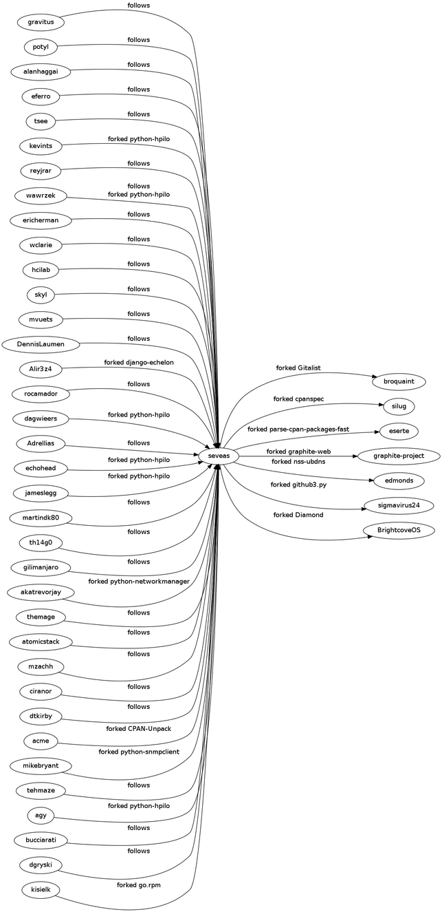

Using github from the CLI
=========================

:command:`git hub` lets you use your github account from the command line.
Among other things, it lets you create and fork repositories, or file pull
requests.

Basic usage
-----------
The first time you use :command:`git hub`, it will ask you for your github
username and password. It then requests (and stores) an API authentication
token, so you can always revoke access from your `profile page`_.

.. describe:: git hub whoami

A simple command to try out is :command:`git hub whoami`, which tells you what
github thinks about who you are. For example::

  dennis@lightning:~$ git hub whoami
  Github user: seveas
  GitHub password: 
  Dennis Kaarsemaker
  Profile   https://github.com/seveas
  Email     dennis@kaarsemaker.net
  Blog      http://www.kaarsemaker.net
  Location  Amsterdam
  Company   Booking.com
  Repos     36 public, 0 private
  Gists     4 public, 0 private
  RSA key   ...N0nFw3oW5l (Dennis)

.. describe:: git hub whois

If you want to see this information about other users, use :command:`git hub whois`::

  dennis@lightning:~$ git hub whois sigmavirus24
  Ian Cordasco
  Profile   https://github.com/sigmavirus24
  Email     graffatcolmingov@gmail.com
  Blog      http://www.coglib.com/~icordasc/blog
  Repos     21 public, 0 private
  Gists     9 public, 0 private

.. describe:: git hub ls-repos [user]

List all repositories owned by a user, by default you.

.. describe:: git hub add-public-keys [keys]

Adds SSH public keys (default: :file:`~/.ssh/*.pub`) to your account.

.. _`profile page`: https://github.com/settings/applications

Interacting with repositories
-----------------------------

.. describe:: git hub create [-d|--description "Description goes here"]

Create a repository on github for your current repository. An optional
description can be given too. After running this command, a repository will be
created on github and your local repository will have github as remote
"origin", so :command:`git push origin master` will work.

.. describe:: git hub set-origin

Fixes the configuration of your repository's remotes. Remote "origin" will be
set to your github repository. If that repository is a fork, remote "upstram"
will be set to the repository you forked from.

.. describe:: git hub clone [repo]

Clones one of your github repositories by name. If it's a fork, the "upstream"
origin will be set up too.

.. describe:: git hub fork [repo]

Forks another person's git repository on github and clones that repository
locally. Repo can be specified as a (git) url or simply username/repo. Like
with set-origin, the "origin" and "upstream" remotes will be set up too.

.. describe:: git hub forks

Lists all forks of this repository, highlighting the original repository.

Issues and pull requests
------------------------

.. describe:: git hub issues [args]

Lists all open issues. You can specify `filters`_ to filter issues.

.. describe:: git hub issue [issue number...]

Shows details about the mentioned issue numbers.

.. describe:: git hub pull-request [yours:theirs]

Files a pull request to merge branch "yours" (default: the current branch) into
the upstream branch "theirs" (default: master). Like for a commit message, your
editor will be opened to write a pull request message. The comments of said
message contain the shortlog and diffstat of the commits that you're asking to
be merged.

.. _`filters`: http://github3py.readthedocs.org/en/latest/repos.html#github3.repos.Repository.list_issues

Gists
-----

.. describe:: git hub gist [-d description] file [file ...]

Creates a gist (with optional description) from the named files. If you specify
:file:`-` as filename, :file:`stdin` will be used, making it easy to pipe
command output to github, for example: :command:`fortune | git hub gist -`

Other 
-----
.. describe:: git hub network

Generates a graphviz graph of people following you, people you follow or people
who's repositories you've forked. For example::

  git hub network | dot -T png -Grankdir=LR > network.png

Here's mine:

